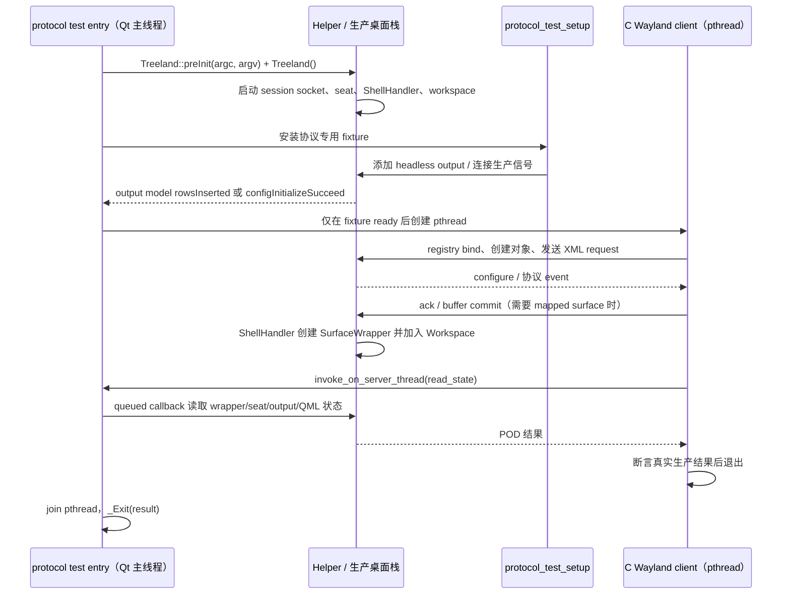
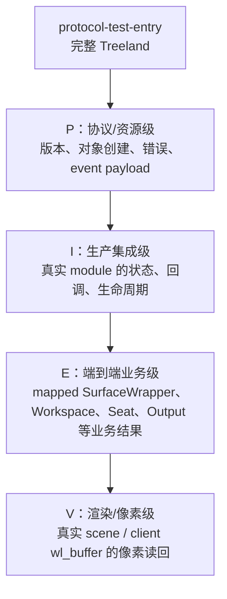

# 协议测试框架架构

## 目的与边界

`tests/protocols/` 不是把协议对象当作孤立 mock 来测。每个 target 都由 QTest 组织用例、纯 C
Wayland client 发起真实线上 request，并由 C++ fixture 启动完整 Treeland；测试再从客户端
event、生产对象状态或渲染读回中取得可观察结果。CTest 负责为每个 target 提供独立进程、环境
变量、超时与 Skip 语义。

框架只有一个启动入口：`framework/protocol-test-entry.cpp`。它为每个 target 启动完整的
`Treeland`、`Helper`、`ShellHandler`、workspace、seat、headless backend 与 QML scene；
`setup.cpp` 只配置 fixture 并取得生产启动路径已经创建的协议对象。

## 总体数据流

```mermaid
flowchart LR
    CTest[CTest / 测试可执行文件]

    subgraph Process[单个隔离测试进程]
        direction LR
        subgraph QtThread[合成器 Qt 主线程]
            Runner[QTest protocol() + ProtocolTestRunner]
            Entry[protocol-test-entry\nTreeland + Helper]
            Prod[生产模块\nShellHandler / Workspace / Seat / Output / QML]
            Entry --> Prod
        end

        subgraph ClientThread[pthread：纯 C Wayland client]
            Client[protocol_test_run]
            Registry[registry bind / listener]
            Assert[request、event 与结果断言]
            Client --> Registry --> Assert
        end

        Socket[隔离的 Wayland socket]
        Client <-->|真实 Wayland request / event| Socket
        Socket <-->|wl_server dispatch| QtThread
        Client -->|invoke_on_server_thread\nqueued callback + QSemaphore| Runner
        Runner -->|读取真实生产对象| Prod
    end

    CTest --> Process
```

关键点：`invoke_on_server_thread()` 不是伪造协议请求。它只把一个**读取或受控 fixture
动作**排队到合成器 Qt 线程，等 callback 返回后才解除 client thread 的 semaphore。协议
request 本身始终经过 Unix Wayland socket 与生产 resource dispatch。

## 启动与业务路径



入口的 `_Exit(result)` 是有意的：Treeland 的进程级 QML singleton 关闭顺序不属于
单协议语义，直接析构会触发与测试无关的 compositor shutdown 路径。所有测试由独立进程运行，
所以这不会污染下一条测试。

## 临时 CI 服务模拟

当前 CI 环境未提供可用的 system D-Bus、`dde-dconfig-daemon` 与
`org.freedesktop.Accounts`，框架暂时以 `test-dconfig-service.*` 创建隔离 D-Bus 和 DConfig
daemon，并以 `test-accounts-service.*` 注册最小 AccountsService/user 对象。这两者仅用于让
完整 Treeland fixture 启动，不是被测协议的 mock，也不应成为长期测试基础设施。

CI 能提供真实 D-Bus、DConfig 与 AccountsService 后，应删除这两个 helper，并让入口直接连接
CI 提供的服务。

## fixture 层次与断言等级



- 即使是资源/错误路径，也必须经完整启动后的 production global 验证；fixture 直接塞入状态或
  手工发送 event，最高只能是 P/I，不能把它标为 E。

## 同步规则

测试不得用“等待 N 毫秒后应当完成”推测服务端状态。应按下面的生产边界同步：

| 等待对象 | 合法同步点 | 示例 |
| --- | --- | --- |
| 客户端初始配置 | `xdg_surface.configure` 后 ack | mapped xdg toplevel |
| 协议 request 已被 server 处理 | `wl_display_roundtrip()` 或规定的 response event | `source_ready`、`commit_success` |
| fixture 可开始 client | output model `rowsInserted`、`configInitializeSucceed`、或 target 的 `protocol_test_ready()` | 需要一个或多个 headless output |
| C++ 生产对象的同步读取 | `invoke_on_server_thread()` 返回 | wrapper/seat/output 的 POD snapshot |
| 异步业务动作 | 对应生产 signal、Wayland event 或 model change | splash `surfaceAdded`、virtual-output rows change |
| 渲染/图像结果 | `renderEnd`、`QFutureWatcher::finished`、capture `ready/failed` | texture 或 client target buffer |

fixture ready 仍由 output model `rowsInserted`、配置完成 signal 或 target 的
`protocol_test_ready()` 驱动；client 完成则以其线程投递到 QTest 用例的 queued signal 唤醒。
两者都不是固定延时或轮询。协议测试自身不能新增固定延时、重试轮询，或没有明确完成
signal/event 的嵌套 event loop。唯一的例外是协议本身要求证明“timeout 到期后仍未发生 event”
的否定结果：观察窗口必须由该协议的 timeout 语义导出，并在对应规范中明确说明，例如
screensaver 的 ext-idle inhibit 用例。若没有可观察的生产 signal/event，应先补出合适的
可观察边界，而不是加 timeout。

`treeland_add_protocol_test()` 确保 `lockscreen`、`multitaskview` target 先完成构建。runner
完全复用 `Treeland` 的正常插件发现和初始化流程：plugin output 目录可访问时使用该目录，
否则回退安装目录。测试框架不再维护独立的插件加载路径或代理实现。

## 代码组织

```text
tests/protocols/
├── framework/
│   ├── protocol-test-entry.cpp         # 唯一的完整 Treeland 入口
│   ├── test-accounts-service.*         # 临时 AccountsService 模拟
│   ├── client-connection.*          # C ABI、registry/bind、disconnect
│   ├── server-bridge-api.h          # C client 调用 compositor 线程的接口
│   ├── test-dconfig-service.*          # 临时 D-Bus 与 DConfig 模拟
│   └── server-bridge.*          # headless output、wl_shm 等 server helpers
├── INDEX.md                            # 可观察契约、覆盖边界与审计
├── protocol-specification-template.md  # 新协议说明模板
└── treeland-<protocol>/                # 协议的 C client、C++ setup 和契约文档
```

每个协议 target 通常包含：

1. `setup.cpp`：C++ fixture。只连接生产模块、创建必要 headless output，并导出很小的 C ABI
   snapshot/read helper；不得替代被测协议直接写业务结果。
2. `treeland-<protocol>.c`：纯 C client。bind global、创建资源、发 XML request、接 listener
   event，并在 request 后断言 client event 或经 bridge 读到的生产状态。
3. `*.h`：client 与 fixture 共用的 POD 状态结构，避免跨线程共享 Qt 对象。
4. `CMakeLists.txt`：使用 `treeland_add_protocol_test()` 注册独立 CTest target。

每个 target 对应一个 QTest `protocol()` 场景。C client 内的具名步骤可以共享同一个 Wayland
连接、resource 和生产状态；它们不是天然可独立执行的 QTest data row。需要进程隔离的独立
场景应拆为新的 protocol target，而不是依赖 QTest 在同一 compositor 进程中重置状态。

## 新测试的验收清单

1. 先从 XML 列出 request 与 event；区分正常路径、错误路径、`since` 版本边界和 destroy。
2. 所有 case 使用统一入口；按资源、生产集成、端到端或渲染层级选择相应的可观察结果。
3. 客户端必须实际调用被测 request；对 event 断言 payload，不能只安装空 listener。
4. E 级测试必须读取真实生产对象或最终客户端效果；fixture 直接发 event 只能证明 P/I。
5. 只以 configure、roundtrip、signal、event、model change 或 future completion 同步。
6. 在对应协议规范和 `README.md` 的 XML 审计表中记录新增覆盖和剩余边界。
