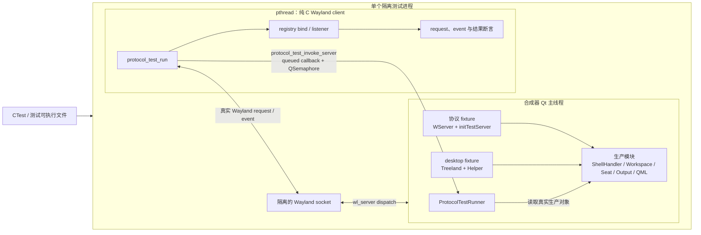
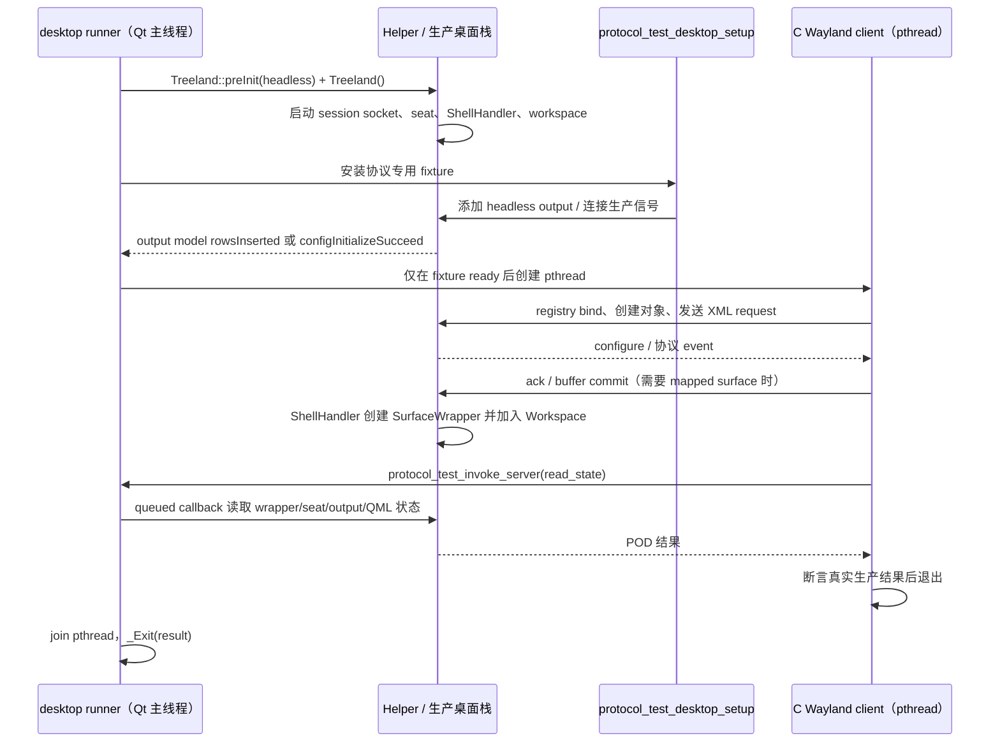
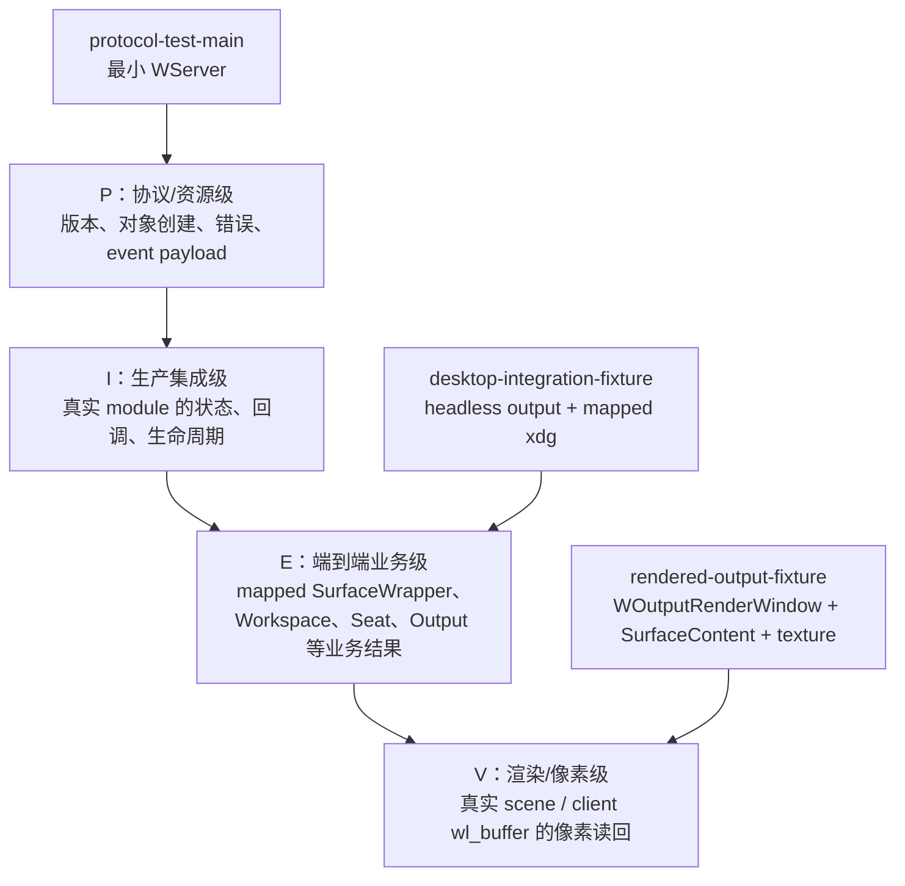

# 协议测试框架架构

## 目的与边界

`tests/protocols/` 不是把协议对象当作孤立 mock 来测。每个 target 都由纯 C 的 Wayland
client 发起真实线上 request，并由 C++ fixture 启动协议服务器或完整 Treeland；测试再从
客户端 event、生产对象状态或渲染读回中取得可观察结果。

框架有两条启动路径：

| 路径 | 入口 | 使用场景 | 生产范围 |
| --- | --- | --- | --- |
| 协议 fixture | `framework/protocol-test-main.cpp` | 资源生命周期、版本、错误和单模块 I/P 测试 | `WServer` + `Treeland::initTestServer()` + 各协议的 `protocol_test_setup(WServer *)` |
| desktop fixture | `framework/protocol-test-desktop-main.cpp` | E/V 级窗口、输入、输出、壁纸、捕获等业务测试 | 完整 `Treeland`、`Helper`、`ShellHandler`、workspace、seat、headless backend 与 QML scene |

## 总体数据流



关键点：`protocol_test_invoke_server()` 不是伪造协议请求。它只把一个**读取或受控 fixture
动作**排队到合成器 Qt 线程，等 callback 返回后才解除 client thread 的 semaphore。协议
request 本身始终经过 Unix Wayland socket 与生产 resource dispatch。

## desktop 业务路径



desktop runner 的 `_Exit(result)` 是有意的：Treeland 的进程级 QML singleton 关闭顺序不属于
单协议语义，直接析构会触发与测试无关的 compositor shutdown 路径。所有测试由独立进程运行，
所以这不会污染下一条测试。

## fixture 层次与断言等级



- `desktop-integration-fixture` 是 E 级的最小公共前提：真实 headless output、mapped
  xdg-toplevel、`SurfaceWrapper` 与 workspace。
- `rendered-output-fixture` 在此基础上找到真实 `WSurfaceItemContent` 与
  `WOutputRenderWindow`，可 render 并通过 `WTextureCapturer` 读回 `QImage`；capture 的
  client `wl_shm` buffer 读回也属于 V 级证据。
- 协议 fixture 可以验证资源/错误路径，但如果它直接塞入状态或手工发送 event，最高只能是
  P/I；不能把它标为 E。

## 同步规则

测试不得用“等待 N 毫秒后应当完成”推测服务端状态。应按下面的生产边界同步：

| 等待对象 | 合法同步点 | 示例 |
| --- | --- | --- |
| 客户端初始配置 | `xdg_surface.configure` 后 ack | mapped xdg toplevel |
| 协议 request 已被 server 处理 | `wl_display_roundtrip()` 或规定的 response event | `source_ready`、`commit_success` |
| desktop fixture 可开始 client | output model `rowsInserted`、`configInitializeSucceed`、或 target 的 `protocol_test_desktop_ready()` | 需要一个或多个 headless output |
| C++ 生产对象的同步读取 | `protocol_test_invoke_server()` 返回 | wrapper/seat/output 的 POD snapshot |
| 异步业务动作 | 对应生产 signal、Wayland event 或 model change | splash `surfaceAdded`、virtual-output rows change |
| 渲染/图像结果 | `renderEnd`、`QFutureWatcher::finished`、capture `ready/failed` | texture 或 client target buffer |

runner 内的 10ms `QTimer` 仅用来在 client thread 已结束后退出 Qt event loop；它不是 fixture
ready、request 完成或业务结果的判定条件。协议测试自身不能新增固定延时、重试轮询，或没有
明确完成 signal/event 的嵌套 event loop。唯一的例外是协议本身要求证明“timeout 到期后仍未
发生 event”的否定结果：观察窗口必须由该协议的 timeout 语义导出，并在对应规范中明确说明，
例如 screensaver 的 ext-idle inhibit 用例。若没有可观察的生产 signal/event，应先补出合适的
可观察边界，而不是加 timeout。

`treeland_add_desktop_integration_test()` 通过 CTest 环境变量
`TREELAND_TEST_PLUGINS_PATH=${TREELAND_PLUGINS_OUTPUT_PATH}` 将当前 build 的 plugin output
目录传给 runner，并确保 `lockscreen`、`multitaskview` target 先完成构建。runner 在构造
`Treeland` 后加载这些生产插件并调用其 `initialize()`，再将已实现的 `IMultitaskView` /
`ILockScreen` 注册到 `Helper`。测试进程因此不会依赖 Release build 的安装目录；正常合成器
的插件发现路径不受影响。


## 代码组织

```text
tests/protocols/
├── framework/
│   ├── protocol-test-main.cpp          # 最小 WServer runner
│   ├── protocol-test-desktop-main.cpp  # 完整 Treeland runner
│   ├── protocol-test-client.*          # C ABI、registry/bind、server callback bridge
│   └── protocol-test-server.*          # headless output、wl_shm 等 server helpers
├── desktop-integration-fixture/        # E 级公共 desktop 前提
├── rendered-output-fixture/            # V 级 scene/texture 前提
├── treeland-<protocol>/                # 协议的 C client + C++ setup
└── specifications/                     # 本目录：可观察契约、覆盖边界与审计
```

每个协议 target 通常包含：

1. `setup.cpp`：C++ fixture。只连接生产模块、创建必要 headless output，并导出很小的 C ABI
   snapshot/read helper；不得替代被测协议直接写业务结果。
2. `treeland-<protocol>.c`：纯 C client。bind global、创建资源、发 XML request、接 listener
   event，并在 request 后断言 client event 或经 bridge 读到的生产状态。
3. `*.h`：client 与 fixture 共用的 POD 状态结构，避免跨线程共享 Qt 对象。
4. `CMakeLists.txt`：选择 `protocol-test-main.cpp` 或 `protocol-test-desktop-main.cpp`，并注册
   独立 CTest target。

## 新测试的验收清单

1. 先从 XML 列出 request 与 event；区分正常路径、错误路径、`since` 版本边界和 destroy。
2. 选择最低足够 fixture：资源语义选 protocol fixture；依赖真实窗口/seat/output 选 desktop；
   要验证绘制内容再选 rendered-output。
3. 客户端必须实际调用被测 request；对 event 断言 payload，不能只安装空 listener。
4. E 级测试必须读取真实生产对象或最终客户端效果；fixture 直接发 event 只能证明 P/I。
5. 只以 configure、roundtrip、signal、event、model change 或 future completion 同步。
6. 在对应协议规范和 `README.md` 的 XML 审计表中记录新增覆盖和剩余边界。
